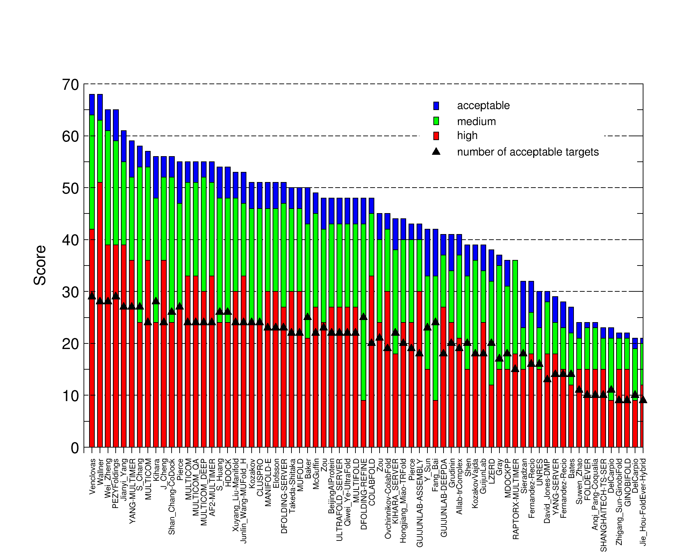
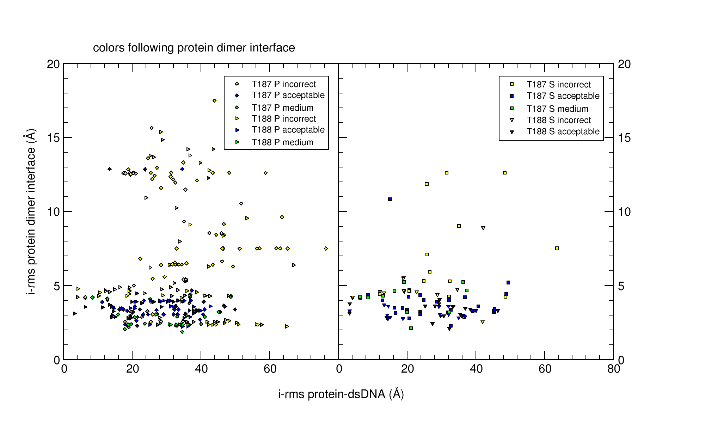
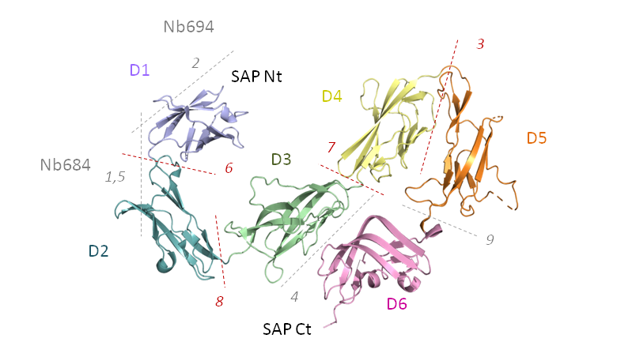

### Round 56

Round 56 consisted of one target, an MHC/antibody complex. Four
servers (CLUSPRO, HADDOCK, LZERD, MDOCKPP) and another six human
predictor groups (Kihara, Zou, Giulini, Brysbaert, Shen) produced
medium-quality models in their top-5 submission. Two groups stand out:
Kozakov, for producing a high-quality model in top-5, and HADDOCK, for
producing a medium-quality model in top-1.

Nine scorer groups including three servers produced medium-quality
models in top-5/top-10, of which five in top-1 (*Chang, Kihara, Zou,
LZERD, MDOCKPP*).

The assessment of all models can be found [here](files/target235.csv).

### Round 55

CAPRI Round 55 had four targets, three of them with antibodies,
including one (T231) binding a peptide. The remaining target (T232)
was an EM structure of an existing X-ray structure, however with a
different binding mode.  For all four targets, the Brysbaert group in
collaboration with the assessors had made AlphaFold2 models available,
which were also assessed.

The results for all four targets of Round 55 can be found in [this
comma-separated file](files/round55.csv).

#### Target T231

The 25 AlphaFold models featured 22 acceptable quality models,
including the first 10 models, 2 medium quality models with models
ranked 13 and 14, and one incorrect model.  Seven predictor groups
(Kozakov/Vajda, Pierce, Karaca, Huang, Venclovas, Zou, Vakser) and 3
servers (CLUSPRO, LZERD, HDOCK) produced medium-quality models in
their top-5 submission.  An additional 7 predictor groups (Bates,
Kihara, S_Chang, Fernandez-Recio, Brysbaert, Giulini, Furman) and one
server (PYDOCKWEB) produced acceptable models.  Scorer groups Giulini,
Huang, Zou and server HDOCK recognized medium quality models, while
scorer groups Kihara, Bates, Venclovas, Karaca and server LZERD
recognized acceptable models.

#### Target T232

The 25 AlphaFold models were all of medium quality.  More than half of
the predictor groups and 80% of the scorer groups also produced 5/5**
models.  With a few rare exceptions, there were no models of
acceptable quality.

#### Targets T233 and T234

These two targets featured binding of two different Fab's to a major
histocompatibility complex-I.  All AlphaFold models were incorrect.
Interestingly, a few groups managed medium-quality solutions (and no
acceptable!) for T233.  These were S_Chang, Kihara, Zou, Venclovas,
Huang and server HDOCK, which were recognized by scorer groups
Venclovas and Zou.  For T234, no acceptable models were submitted by
predictors, but a few acceptable and one medium quality model were
available in the shuffled set.  Only the Giulini scorer group
recognized an acceptable quality model, and submitted it as their
scorer model 10.

### Round 54 CASP15-CAPRI

CAPRI Round 54 comprised 37 targets, divided into 38 Assessment Units
(AU). The assessment results of the top-5 submitted models for
Predictors, Scorers, and CASP Assembly Prediction participants for all
individual target interfaces are collected in [this comma-separated
file](files/casp15_selection.csv).  For explanation of the invididual
columns we refer to the [CAPRI Scoreset v2022 help
page](https://scoreset.org/index.php?csv).

Most AUs are single-target single-interface, with the exception of the
following:

|Target|AU 1|AU 2|
|---|---|---|
|T203 | average of interfaces 1-3 | interface 4|
|T204 | best of interfaces 1-2 | average of interfaces 3-8|
|T219/T220/T221|best of interfaces 1-3|best of interfaces 4|

You can find the slides of Marc Lensink's CAPRI presentation in the
CASP assembly session
[HERE](https://predictioncenter.org/casp15/doc/presentations/Day2/Assessment_Assembly-CAPRI_MLensink.pdf).

The image below shows the CAPRI ranking. "AF2-MULTIMER" is the
off-the-bench AlphaFold-Multimer modeling as submitted by the Elofsson
group.

### Round 53 Target T187 and T188

Targets T187 and T188 featured a large conformational change upon
binding to dsDNA.  However, the AlphaFold monomer structure captured
this conformational change perfectly.  Unfortunately, no predictors or
scorers were able to produce acceptable models for T187.  The
assessment results for the top-5 submitted models are collected in
[this comma-separated file](files/round53_selection.csv).  In this
file, interface 1 corresponds to the whole target; interface 2 is the
protein dimer alone.

For T188 the bound dsDNA structure was given. This resulted in
acceptable models for 2 predictor groups: Fernandez-Recio (top-1) and
Pierce (top-5); and 5 scorer groups: Fernandez-Recio, Zou and server
PYDOCKDNAWEB (top-1), and Kihara and server MDOCKPP (top-5).

Medium-quality models for the protein dimer were produced (in top-5
submission) by Venclovas, Zacharias, Huang, Chang, Kihara, and servers
LZERD and HDOCK. Scorers Kihara, Bates, Huang, Chang, Zou, Shen, and
servers HDOCK, LZERD and PYDOCKDNAWEB recognized these (again, top-5).

The quality of the protein-dnDNA models strongly depended on the
protein dimer modelling quality, as can be seen in the image below.

### Round 52 Target 186

The challenge of T186 was to predict the conformation of a ~100
residue loop lying on the surface of a large pocket. The loop was well
structured but without any secondary structure elements.

Close to 25% of the submitted predictions were missing any coordinates
for the loop residues and were therefore disqualified.  Close to half
of these were of medium quality (for the structure without the loop),
as a high quality template was available for the rest of the protein
assembly.

The loop was part of chain G and in contact with the rest of the chain
as well as chain D. Three assessment were performed: (1) between
chains G and D, (2) between the loop and the rest of chain G, and (3)
between the loop and chain D.  Only acceptable quality models were
obtained.

Predictor groups Kihara and Scorer groups Kihara and Venclovas
obtained acceptable models for both T186.1 as well as T186.2.
Predictor groups Chang, Furman, Fernandez-Recio, Huang and Scorer
groups Oliva, Chang, LZERD, HDOCK, Huang, Zou, MDOCKPP,
Fernandez-Recio, Shen, J_Huang only for T186.1.  No Predictor nor
Scorer groups produced acceptable models for T186.3.

The full list of assessment is [here](files/round52.csv), do note that
this list includes the disqualified models (look for the "clashes" or
"low_id" flag in columns 36 and 37, resp.

### Round 49 Target T163

Target T163 features a 2:2 hetero-tetramer, with 2 copies of SYCE2 and
2 copies of TEX12.  It has now been published as PDB 6R17.  T163
contains 2 homo-dimeric interfaces: T163.1 (SYCE2) and T163.5 (TEX12);
and 3 hetero-dimeric interfaces: T163.2 (SYCE2.Nt/TEX12), T163.3
(SYCE2'.Ct/TEX12) and T163.4 (SYCE2.Ct/TEX12').

A homo-dimeric structure of TEX12 existed, but it did not correspond
to the binding mode in T163.  This might have complicated the
prediction of this target.  The assessment results for the 5
interfaces can be found in [this comma-separated
file](files/target163_selection.csv).

Predictors and Scorers with models of acceptable quality or better in
their top-5 submitted models are listed in the following table:

|Interface|Predictors|Scorers|
|---|---|---|
|T163.1|-|Fernandez-Recio|
|T163.5|Kihara (medium)|Kihara (medium)|
|T163.2|Venclovas, Kihara, Gray|Seok (medium), Oliva, Perthold|
|T163.3|-|-|
|T163.4|LZERD|-|

### Round 48 Targets T161 and T162

Both targets feature the same toxin-antitoxin complex, a
hetero-complex consisting of a toxin homo-dimer bound to two antitoxin
molecules.  The challenge of T161 was to predict the bound form of the
toxin homodimer, which forms a completely different structure than in
its unbound form. The challenge for T162 was to predict the structure
of the full toxin-antitoxin complex. For T162, the bound structure of
the antitoxin was supplied, with side-chains removed, as well as *all*
submitted models (predictors and scorers) of the toxin homo-dimer
(T162).  The full assessment is [here](files/round48.csv).

Only two groups managed to produce good models for these targets:

|Target|Group|Performance|
|---|---|---|
|T161|Bates|1|
|T162|Andreani/Guerois|2/1**|

### Round 47 Target T160

Target T160 features the structure of the Bacillus anthracis Sap
S-layer assembly domain, now published as PDB 6HHU.  It consists of 6
individual domains that are organized in two dimensions.  To it are
bound two nanobodies.  The individual interfaces bury between 150 and
610 &Aring;2.  The interfaces are indicated in the
following picture of the target.

Nanobody Nb694 is bound to domain D1 through interface T160.2, while
Nb684 is bound to domains D1 and D2 through interfaces T160.1 and
T160.5.  Whereas the interface between domains 1 and 2 was best
predicted, nobody managed to identify the nanobody binding modes.  The
results for all interfaces can be found in [this comma-separated
file](files/target160_selection.csv).  Predictors and Scorers with
models of acceptable quality or better in their top-5 submitted models
are listed in the following table:

|Interface|Predictors|Scorers|
|---|---|---|
|T160.2|-|-|
|T160.1|-|-|
|T160.5|-|-|
|T160.6|GALAXYPPDOCK, Fernandez-Recio,|Fernandez-Recio, Kihara, |
|      |Andreani/Guerois|LZERD, Venclovas, Bates|
|T160.8|Andreani/Guerois (medium),|Venclovas (medium)|
|      |Kozakov/Vajda (medium), Venclovas (medium)||
|T160.7|Gray|-|
|T160.3|CLUSPRO (medium), Kozakov/Vajda (medium),|Venclovas (medium)|
|      |Andreani/Guerois (medium), Venclovas (medium)||
|T160.9|-|HDOCK|
|T160.4|-|-|

For questions or comments please contact [Marc Lensink](mailto:marc.lensink@univ-lille.fr)
